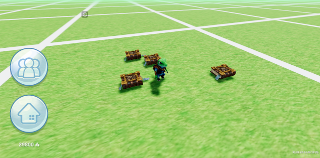

# Masonry-AR

 

Masonry-AR is an augmented reality (AR) game centered around Freemasonry. Players engage in strategic gameplay, building Masonic lodges, and competing for control over real-world locations.

Key Features:  
  
- Tactical Conquest: Build Masonic lodges strategically to expand influence.  
- Territorial Battles: Compete against other players for control of landmarks.  
- Order Creation: Establish personalized Masonic orders with unique characteristics.  
- Hidden Discoveries: Uncover secret knowledge and artifacts through exploration.  
- Alliance Formation: Collaborate with others to strengthen positions.  
- Engaging Narrative: Immerse yourself in a rich world of mystery and intrigue.  
  

# Tools  
https://github.com/mrdoob/three.js  
https://github.com/phan/phan  
https://www.python.org  
https://www.typescriptlang.org  
https://www.php.net  
https://mariadb.org  
https://developer.mozilla.org/en-US/docs/Web/API/WebGL_API  
https://httpd.apache.org  
https://www.blender.org  
https://www.dropbox.com  
https://github.com/demensdeum/CleanTerminus  
https://www.phpmyadmin.net  

# How to Run  

* Install all tools on [Arch Linux](https://archlinux.org)  
* Download client "assets" directory from here: https://www.dropbox.com/scl/fo/v4vqvgt5mgdf9l5eigyng/h?rlkey=o93ppvn5jjx54sxh1nbkcsdex&dl=0  
* Put "assets" directory into the "client" directory as "assets-src"
* Create database  
* Apply sql scripts from server/sql directory
* Change credentials in server/src/config.php  
* Run build_and_deploy.py  
* Fix/install more tools, change configs/source code  
* Run build_deploy.py  
* Repeat until success  
* Run game in lastest browser for your platform

# Play
You can play last version here:
[https://demensdeum.com/demos/masonry-ar/client/](https://demensdeum.com/demos/masonry-ar/client/)